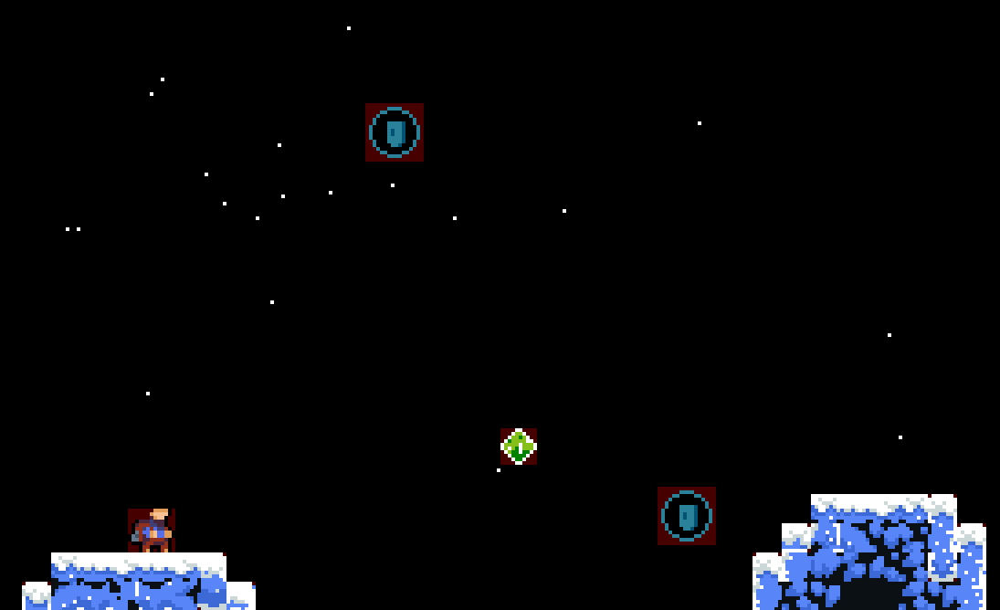

# 2D Game Engine

A custom **2D game engine** built in **C++20** with **SFML**.  

Features include a physics engine, an extensible event bus, a flexible callback scheduler, and robust player state management.

---

## Example Game GIF



Demo uses sprites and tiles from Celeste (© Maddy Makes Games), used here for non-commercial demonstration purposes only.

Find details about this game on [this](https://github.com/agamjeetsingh/2d-game-engine/wiki/2D-Platformer) wiki page.

## Features
- **Physics Engine**
    - AABB collision detection, impulse-based resolution,
      and positional correction
    - Uses spatial hashing instead of naive pairwise checking for detecting collisions
    - A contacts handler which can emit events such as `PlayerLanded` and to which you can efficiently query current and previous frames' physics states 
- **Thread-safe Event Bus**
    - Ability to emit events and listeners' callbacks being executed by the Event Bus on certain specified safe points in the program.
    - Listener priority system for fine-grained control over game logic
- **Thread-safe Callback Scheduler**
    - Schedule deferred or repeating callbacks
    - Supports cancellation (even from inside callbacks)
- **Sound Manager and Render System**
    - Thread-safe central audio manager that stores sound buffers and plays them on demand
    - Render class to which you can draw a sprite at will or register a `Drawable` to be drawn each frame
- **Particle System**
    - General particle system with arbitrary velocity and colour functions to create any particle effect
    - Implemented some example effects, such as a snow storm
- **Other miscellaneous features**
    - JSON map loader to load any JSON map from the Tiled map editor
    - Reusable thread pool for parallel task execution
    - General system for 2D sprite management

More detailed explanations, diagrams, and usage guides can be found in the [Wiki](https://github.com/agamjeetsingh/2d-game-engine/wiki)
(Work in Progress).

---
## Getting Started

### Prerequisites
- C++20 compiler (GCC 10+, Clang 10+, or MSVC 2019+)
- CMake 3.31+
- GLFW 3.4+ (required; other dependencies are handled automatically)

### Installing GLFW
**macOS (using Homebrew):**
```bash
brew install glfw
```

**Ubuntu/Debian:**
```bash
sudo apt update
sudo apt install libglfw3-dev
```

**Windows:**
Download GLFW from https://www.glfw.org/download.html
and follow instructions to install it.

⚠️ SFML 3.0.1+, GLM, and nlohmann_json are automatically downloaded and configured via CMake’s FetchContent. No manual installation required.

### Build & Run
```bash
git clone https://github.com/agamjeetsingh/2d-game-engine.git
cd 2d-platformer
mkdir build && cd build
cmake ..
cmake --build .
./2d-platformer
```

---

## Benchmarks

`benchmarks/CollisionBenchmark.cpp` uses [Google Benchmark](https://github.com/google/benchmark) (fetched via
CMake `FetchContent`, built as a separate `benchmarks` target — it is never linked into the GoogleTest suite,
so no timing assertions run there) to measure `CollisionsHandler`'s three contact-building strategies:

- `buildContacts` — naive all-pairs, swept AABB
- `buildContactsFaster` — spatial hash + swept AABB
- `buildContactsBlankFaster` — spatial hash + direct rect intersection (the one `update()` actually calls in production)

Objects are scattered pseudorandomly (fixed seed) across a 4000×2000px play area with hitboxes ranging 8-64px a
side and a 70/30 immovable/movable split, so the spatial hash meaningfully partitions space instead of
degenerating into one bucket.

**Build config:** `CMAKE_BUILD_TYPE=Release` → AppleClang 17.0.0 (arm64), flags `-O3 -DNDEBUG -std=gnu++20`.
**Machine:** Apple M4, macOS 26.0.1, 10 cores.

Run with:
```bash
cmake -S . -B build-release -DCMAKE_BUILD_TYPE=Release
cmake --build build-release --target benchmarks
./build-release/benchmarks --benchmark_min_time=0.3s --benchmark_repetitions=3 --benchmark_report_aggregates_only=true
```

Measured (mean of 3 repetitions, ms/frame, Release build). `buildContacts` and `buildContactsFaster` run the
*same* swept-AABB algorithm, differing only in all-pairs vs. spatial hashing, so this is the fair, isolated
measurement of what spatial partitioning alone buys:

| Objects | Naive (`buildContacts`) | Spatial (`buildContactsFaster`) | Speedup |
|--------:|-------------------------:|----------------------------------:|--------:|
| 100     | 0.858 ms                 | 0.014 ms                          | ~61x    |
| 500     | 21.4 ms                  | 0.214 ms                          | ~100x   |
| 1000    | 85.8 ms                  | 0.831 ms                          | ~103x   |
| 2000    | 340 ms                   | 3.30 ms                           | ~103x   |

`buildContactsBlankFaster` — the one `update()` actually calls in production — is faster still, but that
comparison isn't apples-to-apples: on top of spatial hashing it also drops swept (continuous) collision for a
cheaper direct rect-intersection test, so part of its speedup is a different, simpler algorithm rather than
partitioning. Numbers will vary by machine/compiler; re-run the benchmark above to reproduce.

---

## Roadmap
### Towards Testing and Dependency Injection
Currently, the project barely has any tests, which is partially attributed to singleton spam. 
Singletons lead to tightly-coupled and hard to test code. Therefore, I will move away from this singleton pattern and 
use dependency injection. Some classes (CollisionsHandler, SoundManager) have already been converted but there is still 
a lot of work to do.

### The Project as a Library
This project started as a Celeste-inspired platformer built from scratch without using existing game engines. As
development progressed, the engine framework became robust enough to warrant extracting it as a reusable library.
This transition requires significant refactoring: decoupling game-specific code from general engine components,
implementing proper namespace organisation, and designing intuitive APIs. The refactoring process is pushing me to
think critically about software architecture and API design, and it also prompted me to make a GitHub Wiki (Work in 
Progress!).

### Graphics, SFML and OpenGL
I recently started working on a project to make my own [Minecraft clone](https://github.com/agamjeetsingh/3d-voxel)
from scratch, learning OpenGL in the process. This sparked a realisation: if I can build a 3D rendering pipeline,
why rely on SFML for 2D? I'm planning to replace SFML with my own OpenGL-based graphics pipeline to gain complete
control over the rendering process and deepen my understanding of graphics programming.

### Platformer Game
These are some general ideas I had for my platformer game that I haven't implemented yet.
- Enemies with AI including natural movement
- Full lighting system with shaders
- Camera that follows the player naturally
- Pausing the game, general input buffering, freeze frames
